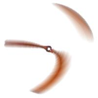

# Rolling-Shutter Effect

Since CMOS cameras cannot read all pixels illumination at the instant time, especially when the object's speed is extremely fast such as propellers, there could be some artifacts on digital images which is well-known artifacts named Rolling-Shutter Effects. 

In that projects, we represented very brief Matlab simulation of this effect during certain propeller turns at the fixed certain round per minute. Within provided demo, you can adjust speed of propeller, fps of simulated camera, number of frame of simulation. We provided one propeller image but you can create your own propeller image and simulate it as well.

    
    
   

Rolling shutter effect simulation with Matlab
